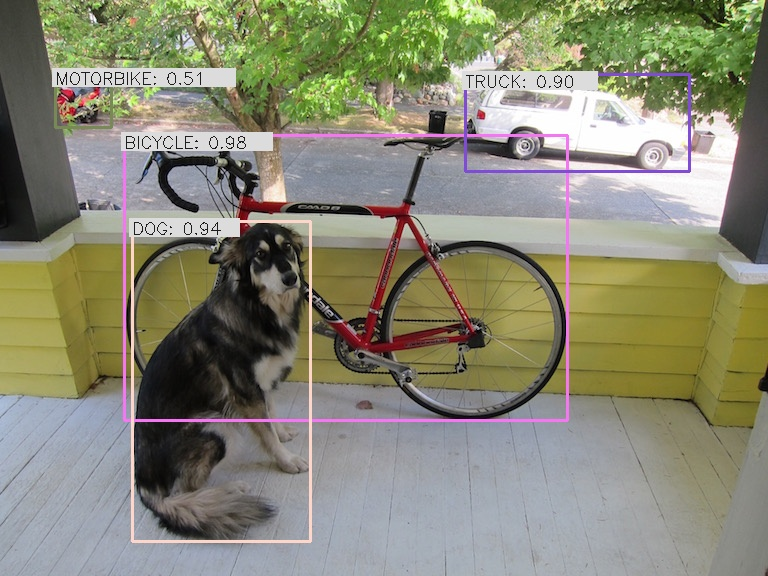

# Triton Inference Server Client For YOLO Models

The Triton Inference Server simplifies the deployment of machine learning models with a plethora of out-of-the-box benefits, including a GRPC and HTTP interface, automatic scheduling on multiple GPUs, shared memory utilization (even on GPUs), dynamic server-side batching, health metrics, and memory resource management.

This repository utilizes the Triton Inference Server Client, which streamlines the complexity of model deployment. <br>
The client is lightweight and requires minimal infrastructure, making it an ideal choice for deploying/testing YOLO models efficiently.

This repository is a continuation of the work on Triton Client by Philipp Schmidt, available [here](https://github.com/philipp-schmidt/yolov7/tree/triton-deploy/deploy/triton-inference-server).


## Enhancements
- Added support for evaluating the model using the COCO dataset with models built on TensorRT engines.

### Triton Server 
Make sure that the Triton Server is up and running with the required models.
To set up the Triton Server, you can utilize the repository [triton-server-yolo](https://github.com/levipereira/triton-server-yolo).


## Install Triton Client YOLO
``` bash
# recommended use python virtual environment
git clone https://github.com/levipereira/triton-client-yolo.git
cd triton-client-yolo
pip install -r requirements.txt
```


## Evaluating Coco Dataset on Yolo Models.

### Prerequisite 
Download Coco Dataset Manually.
```bash
bash ./scripts/get_coco.sh
```

### How to Evalulate Coco Dataset
Example: 
```bash
python3 coco_eval.py --model yolov9-c --data data/coco.yaml


==================== TRITON SERVER ====================
Evaluating Model:  yolov9-c
Inferencing images: 100%|██████████████████████████████████████████████████████████████████████| 5000/5000 [02:20<00:00, 35.66it/s]

Evaluating pycocotools mAP... saving ./_predictions.json...
loading annotations into memory...
Done (t=0.32s)
creating index...
index created!
Loading and preparing results...
DONE (t=6.19s)
creating index...
index created!
Running per image evaluation...
Evaluate annotation type *bbox*
DONE (t=73.49s).
Accumulating evaluation results...
DONE (t=22.59s).

========================= EVALUATION SUMMARY - YOLOV9-C ========================
 Average Precision  (AP) @[ IoU=0.50:0.95 | area=   all | maxDets=100 ] = 0.528
 Average Precision  (AP) @[ IoU=0.50      | area=   all | maxDets=100 ] = 0.700
 Average Precision  (AP) @[ IoU=0.75      | area=   all | maxDets=100 ] = 0.576
 Average Precision  (AP) @[ IoU=0.50:0.95 | area= small | maxDets=100 ] = 0.361
 Average Precision  (AP) @[ IoU=0.50:0.95 | area=medium | maxDets=100 ] = 0.582
 Average Precision  (AP) @[ IoU=0.50:0.95 | area= large | maxDets=100 ] = 0.689
 Average Recall     (AR) @[ IoU=0.50:0.95 | area=   all | maxDets=  1 ] = 0.392
 Average Recall     (AR) @[ IoU=0.50:0.95 | area=   all | maxDets= 10 ] = 0.652
 Average Recall     (AR) @[ IoU=0.50:0.95 | area=   all | maxDets=100 ] = 0.702
 Average Recall     (AR) @[ IoU=0.50:0.95 | area= small | maxDets=100 ] = 0.539
 Average Recall     (AR) @[ IoU=0.50:0.95 | area=medium | maxDets=100 ] = 0.758
 Average Recall     (AR) @[ IoU=0.50:0.95 | area= large | maxDets=100 ] = 0.848
================================================================================
mAP@0.5:0.95: 0.528
mAP@0.5:      0.7
mAP@0.75:     0.576
================================================================================
```

## Usage
```
usage: coco_eval.py [-h] [-d DATA] [-m MODEL] [--width WIDTH] [--height HEIGHT] [-u URL] [-v] [-t CLIENT_TIMEOUT] [-s] [-r ROOT_CERTIFICATES] [-p PRIVATE_KEY] [-x CERTIFICATE_CHAIN]

options:
  -h, --help            show this help message and exit
  -d DATA, --data DATA  dataset.yaml path
  -m MODEL, --model MODEL
                        Inference model name, default yolov7
  --width WIDTH         Inference model input width, default 640
  --height HEIGHT       Inference model input height, default 640
  -u URL, --url URL     Inference server URL, default localhost:8001
  -v, --verbose         Enable verbose client output
  -t CLIENT_TIMEOUT, --client-timeout CLIENT_TIMEOUT
                        Client timeout in seconds, default no timeout
  -s, --ssl             Enable SSL encrypted channel to the server
  -r ROOT_CERTIFICATES, --root-certificates ROOT_CERTIFICATES
                        File holding PEM-encoded root certificates, default none
  -p PRIVATE_KEY, --private-key PRIVATE_KEY
                        File holding PEM-encoded private key, default is none
  -x CERTIFICATE_CHAIN, --certificate-chain CERTIFICATE_CHAIN
                        File holding PEM-encoded certicate chain default is none

```

## How to Inference model in your code

Example client can be found in client.py. It can run dummy input, images and videos.

```bash
python3 client.py image --model yolov9-e data/dog.jpg
```



```
$ python3 client.py --help
usage: client.py [-h] [-m MODEL] [--width WIDTH] [--height HEIGHT] [-u URL] [-o OUT] [-f FPS] [-i] [-v] [-t CLIENT_TIMEOUT] [-s] [-r ROOT_CERTIFICATES] [-p PRIVATE_KEY] [-x CERTIFICATE_CHAIN] {dummy,image,video} [input]

positional arguments:
  {dummy,image,video}   Run mode. 'dummy' will send an emtpy buffer to the server to test if inference works. 'image' will process an image. 'video' will process a video.
  input                 Input file to load from in image or video mode

optional arguments:
  -h, --help            show this help message and exit
  -m MODEL, --model MODEL
                        Inference model name, default yolov7
  --width WIDTH         Inference model input width, default 640
  --height HEIGHT       Inference model input height, default 640
  -u URL, --url URL     Inference server URL, default localhost:8001
  -o OUT, --out OUT     Write output into file instead of displaying it
  -f FPS, --fps FPS     Video output fps, default 24.0 FPS
  -i, --model-info      Print model status, configuration and statistics
  -v, --verbose         Enable verbose client output
  -t CLIENT_TIMEOUT, --client-timeout CLIENT_TIMEOUT
                        Client timeout in seconds, default no timeout
  -s, --ssl             Enable SSL encrypted channel to the server
  -r ROOT_CERTIFICATES, --root-certificates ROOT_CERTIFICATES
                        File holding PEM-encoded root certificates, default none
  -p PRIVATE_KEY, --private-key PRIVATE_KEY
                        File holding PEM-encoded private key, default is none
  -x CERTIFICATE_CHAIN, --certificate-chain CERTIFICATE_CHAIN
                        File holding PEM-encoded certicate chain default is none
```
